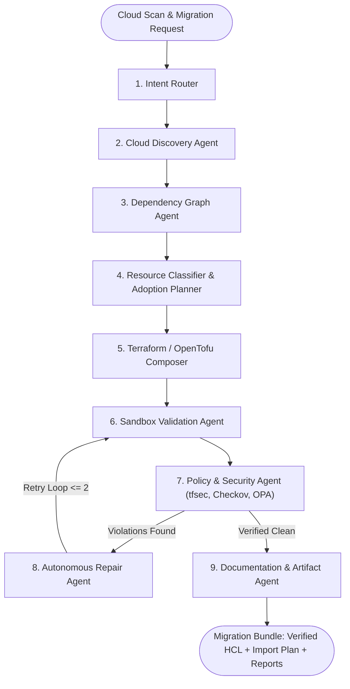

# TerraAgent 🌍⚡
### *Next-Generation Cloud Migration & Infrastructure Intelligence Platform*

> **Stateful Multi-Agent AI Platform that Discovers, Maps, and Modernizes Legacy AWS ClickOps Environments into Production-Grade, Validated Terraform & OpenTofu Architecture.**

[](https://www.python.org/)
[](https://fastapi.tiangolo.com/)
[](https://nextjs.org/)
[](https://langchain-ai.github.io/langgraph/)
[](https://www.docker.com/)
[](https://render.com/deploy)

---

## 🧭 Executive Overview & Platform Positioning

**TerraAgent** is an enterprise **Cloud Migration & Infrastructure Intelligence Platform**. It bridges the gap between opaque, unmanaged cloud environments and modern Infrastructure-as-Code (IaC) DevOps standards. 

By replacing high-risk manual reverse-engineering and spreadsheet-based auditing, TerraAgent delivers continuous infrastructure intelligence: discovering live topologies, uncovering hidden cross-resource dependencies, calculating staged migration wave schedules, and autonomously synthesizing battle-tested Terraform/OpenTofu code with automated compliance auditing and self-repair.

```
       [ Live AWS Estate ]  --->  ( Read-Only Discovery )
                                          │
                                          ▼
   [ Infrastructure Intelligence ] --->  ( Graph DAG & Adoption Waves )
                                          │
                                          ▼
   [ Automated IaC Synthesis ]    --->  ( 8-Agent LangGraph Pipeline )
                                          │
                                          ▼
 [ Zero-Drift Modernization ]    --->  ( Validated HCL + Migration Plan )
```

---

## ⚡ Core Pillars of the Platform

### 1. 🔍 Autonomous Infrastructure Discovery & Asset Intelligence
- **Zero-Footprint Read-Only Audit**: Non-invasive inspection of AWS estates (VPC, Subnets, EC2, S3, RDS, IAM, Security Groups, Route Tables) using least-privilege read APIs (`Describe*`, `Get*`, `List*`).
- **Resource Classification**: Automatically categorizes assets into *Managed*, *Shared/Data-Source*, and *Review-Required* to prevent accidental drift or state pollution.

### 2. 🕸️ Deep Dependency Graph Topology (DAG Engine)
- **Topological Adjacency Mapping**: Resolves cross-resource references (e.g., Subnet $\rightarrow$ Route Table $\rightarrow$ IGW $\rightarrow$ VPC) avoiding brittle hardcoded IDs.
- **Phased Migration Wave Scheduling**: Automatically partitions resources into ordered migration waves for safe, incremental adoption.
- **Interactive D3.js Visualization**: Real-time visual exploration of infrastructure clusters and security perimeters.

### 3. 🤖 8-Agent LangGraph Orchestration & Synthesis
- **Deterministic HCL Generation**: Synthesizes clean, modular HCL (`main.tf`, `variables.tf`, `outputs.tf`, `providers.tf`) without fake placeholder defaults.
- **Multi-Engine Support**: Native code generation for both **HashiCorp Terraform** and **OpenTofu**.
- **Sandboxed Validation**: Automated sandbox verification executing `fmt -check`, `init -backend=false`, and `validate`.

### 4. 🛡️ Continuous Policy-as-Code & Security Guardrails
- **Multi-Layer Compliance Auditing**: Built-in verification with `tfsec`, `Checkov`, `Trivy`, and `Conftest` (OPA Rego policies).
- **Autonomous Self-Repair Loops**: Automatically analyzes policy violations, prompts targeted repairs, and re-validates up to 2 retry cycles.
- **Human-in-the-Loop Governance**: Approval gates for sensitive infrastructure changes with full audit-trail logging.
- **Hard Execution Tripwires**: Code-level chokepoints strictly prevent `apply`/`destroy`/`import` command execution.

---

## 🏗️ 8-Agent Migration Architecture



---

## 🛠️ Technology Stack

| Layer | Technologies |
|---|---|
| **Intelligence & UI** | Next.js 14 (App Router), TypeScript, Tailwind CSS, D3.js (Topology Graph) |
| **API & Backend** | FastAPI (Async Python 3.11+), Pydantic v2 (SecretStr), Uvicorn |
| **Multi-Agent Core** | LangGraph (StateGraph), LangChain Core |
| **Inference Engines** | Google Gemini API (Cloud) & Ollama (`codellama`, `llama3` for Local) |
| **Message Broker & Queue** | Celery + Redis 7 + Server-Sent Events (SSE) Live Streaming |
| **Persistence & Audit** | PostgreSQL (SQLAlchemy ORM audit log & job history) |
| **Security & Policy CLI** | Terraform CLI, OpenTofu CLI, `tfsec`, `Checkov`, `Trivy`, `Conftest` (OPA) |
| **Deployment & Ops** | Render Blueprint (`render.yaml`), Docker, Docker Compose |

---

## 🚀 Quick Start (Localhost)

### 1. Clone & Configure
```bash
git clone https://github.com/rashikagangraj/TerraAgent.git
cd TerraAgent
cp .env.example .env
```

### 2. Start Locally
- **Backend API**:
  ```bash
  cd backend
  python -m uvicorn main:app --host 0.0.0.0 --port 8000 --reload
  ```
- **Frontend Dashboard**:
  ```bash
  cd frontend
  npm run dev -p 3000
  ```
- **Access UI**: [http://localhost:3000](http://localhost:3000)

---

## ☁️ Cloud Deployment on Render

TerraAgent includes a native Render Blueprint ([`render.yaml`](render.yaml)) supporting 1-click deployment:

1. Push your repository to GitHub / GitLab.
2. In [Render Dashboard](https://dashboard.render.com), click **New +** $\rightarrow$ **Blueprint**.
3. Select this repository and click **Apply**.
4. Configure your `GEMINI_API_KEY` under the Environment tab of `terraagent-api` and `terraagent-celery`.

👉 *For detailed configuration, see the [Render Deployment Guide](docs/RENDER_DEPLOYMENT.md).*

---

## 📄 License
Distributed under the MIT License.
